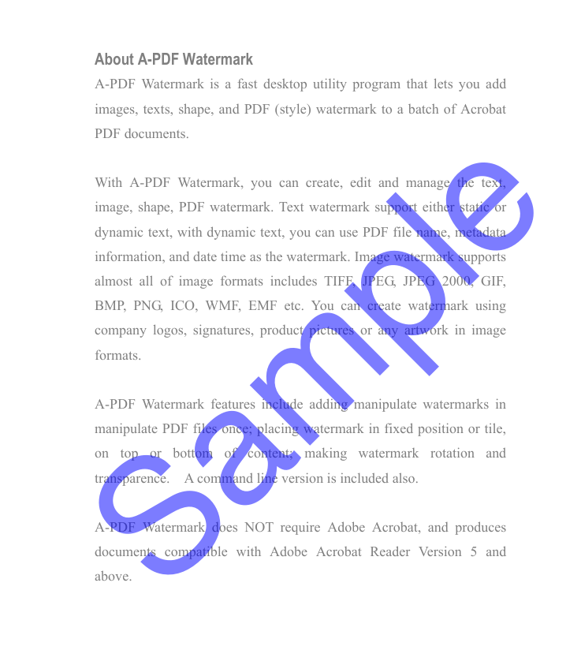
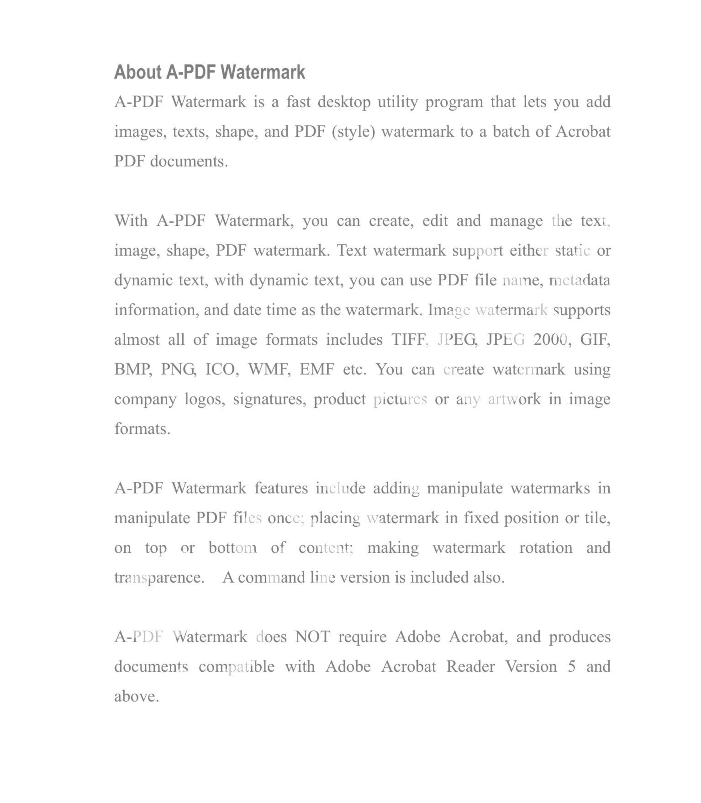
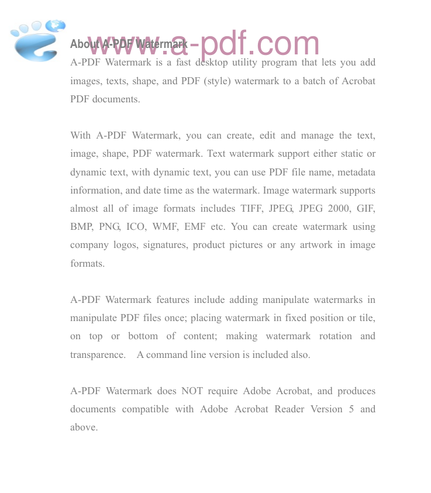
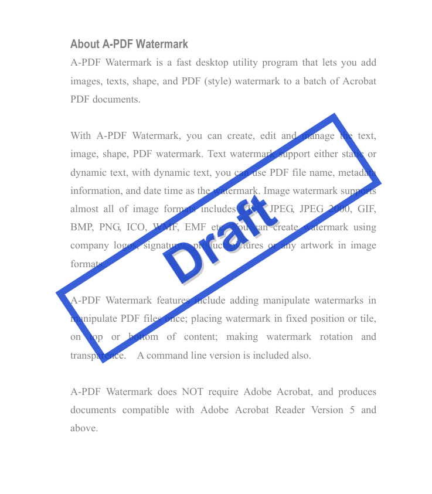
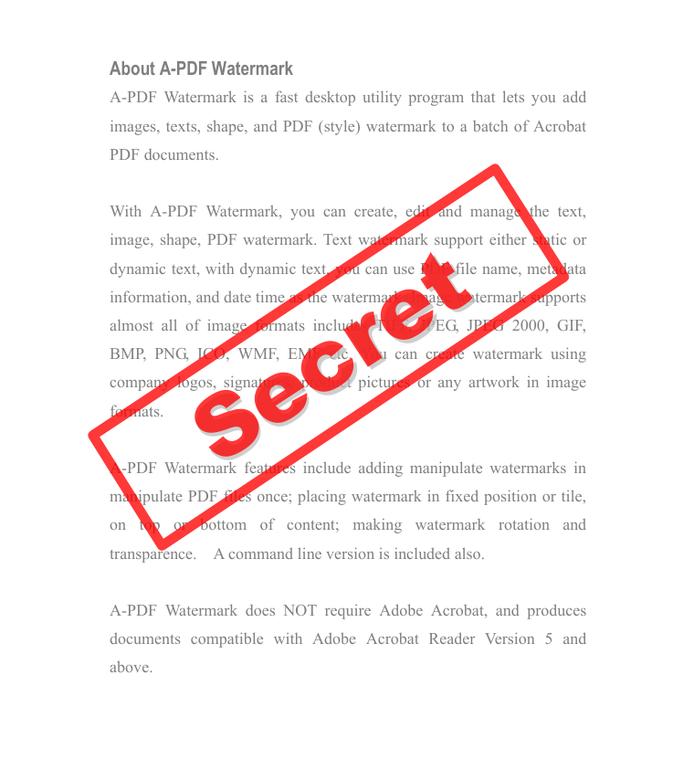
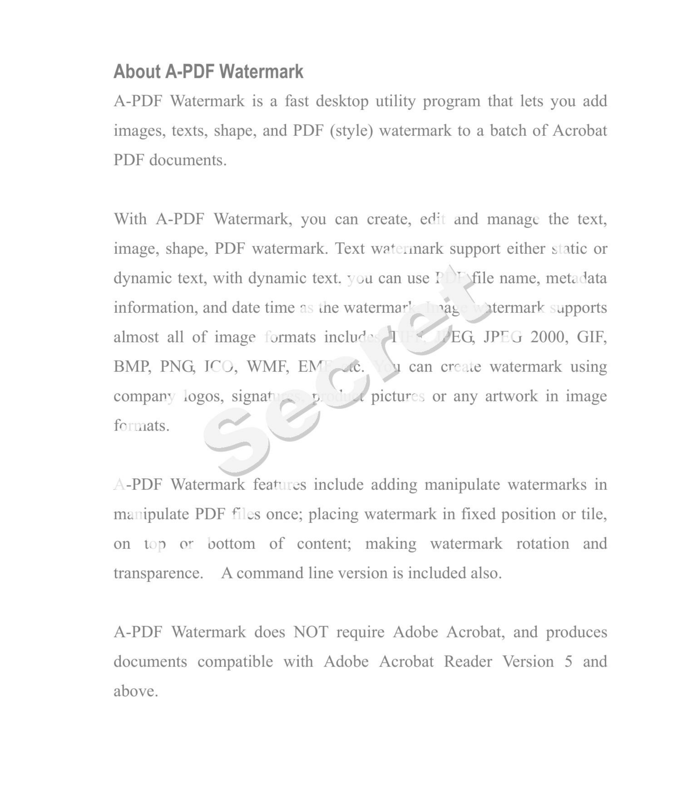

# 自动 PDF 水印去除工具
[中文](readme-zh.md)｜[English](README.md)

## 案例

下方展示了去水印前后页面的对比。  
左侧为原始图片（`input-samples`），右侧为处理后图片（`output-samples`）。

| 原图 | 去水印后 |
|:--------:|:-------:|
|  |  |
|  |  |
|  |  |
|  |  |
<!-- 可添加更多样例：
|  |  |
-->

一个本地 Python 小工具，尝试通过将 PDF 页面渲染为图像、对图像进行水印像素处理，然后重建 PDF 来去除或减弱可见的彩色水印。仓库包含两个脚本：

- `watermarkrm-rgb.py` — 用户指定水印颜色（RGB）模式。
- `watermarkrm-auto.py` — 自动检测可能的水印颜色并处理页面。

两个脚本采用三步流水线：将 PDF 页面导出为图像 -> 在图像中去除水印像素 -> 从清理后的图像重建 PDF。

**重要说明：** 本工具仅针对“彩色”水印。黑白/灰度或纯黑文字类水印通常需要采用其他技术（如内容级/矢量对象移除、二值化/阈值化清理等），本脚本不支持。

## 特性

- 处理当前工作目录下的所有 `*.pdf` 文件。
- 两种模式：手动 RGB（精确）与自动检测（方便）。
- Debug 模式会保存中间图像，便于查看导出与处理结果。
- 完全本地运行，无网络调用，使用 OpenCV 与 PyMuPDF（fitz）。

## 工作原理（概述）

1. 使用 PyMuPDF 将 PDF 每页渲染成图像（可调 DPI）。
2. 使用输入 RGB 或自动检测的颜色作为中心值构建颜色掩膜，识别水印像素。
3. 使用形态学操作和 HSV 空间调整来弱化或替换水印区域的像素。
4. 将处理后的图像合并为新的 PDF。

注意：该工具针对简单的彩色或半透明水印做“最佳努力”去除。复杂混合或矢量水印可能无法完全去除。

## 依赖

- Python 3.8 及以上
- 需要的包（通过 pip 安装）：
  - PyMuPDF（导入名 `fitz`）
  - opencv-python（cv2）
  - numpy
  - Pillow

安装依赖：

```bash
python -m pip install --upgrade pip
python -m pip install pymupdf opencv-python numpy pillow
```

## 使用方法

1. 将待处理的 PDF 放到脚本所在目录，或切换到该目录。
2. 运行下面的脚本之一。

### 手动 RGB 模式（更精确）

当你知道水印的大致颜色时，使用 `watermarkrm-rgb.py`：

```bash
python watermarkrm-rgb.py -r <RED> -g <GREEN> -b <BLUE>

# 示例：
python watermarkrm-rgb.py -r 249 -g 249 -b 249
```

参数说明：
- `-r`, `--red` — 红色通道 0–255（必需）
- `-g`, `--green` — 绿色通道 0–255（必需）
- `-b`, `--blue` — 蓝色通道 0–255（必需）
- `--debug` — 开启调试模式并保存中间文件

### 自动检测模式（更方便）

当你不知道水印颜色时，使用 `watermarkrm-auto.py`，脚本会尝试自动检测一个可能的水印颜色：

```bash
python watermarkrm-auto.py

# 带调试模式：
python watermarkrm-auto.py --debug
```

### 调试模式下会发生什么

当传入 `--debug` 参数时，脚本会在当前目录下创建两个中间文件夹：

- `images_extracted/` — 导出的页面 PNG
- `images_cleaned/` — 去水印后的 PNG

最终处理后的 PDF 会写入 `./output/`，文件名与原文件名一致。

## 调优建议

- 渲染 DPI：默认 300 DPI。提高 DPI 可得到更高保真度，但会占用更多内存和磁盘空间。
- 如果自动模式效果不理想，可查看 `images_extracted/` 中的样例像素并使用 `watermarkrm-rgb.py` 进行手动处理。
- 对于轻微或复杂的水印，可在脚本中调整色差容差（`tol`）、形态学核大小与膨胀次数等参数。

## 限制

- 不适用于黑白/灰度水印；请使用其他方法（如内容级编辑、二值化/阈值工具等）。
- 该工具对简单的彩色或半透明水印效果最好，不适用于：
  - 嵌入为矢量对象的水印
  - 与背景纹理或渐变混合的水印
  - 含复杂层次透明度的文档

建议始终保留原始文件的备份。

## 故障排查

- 打开 PDF 出错：确认文件不是加密或损坏的 PDF。
- 输出出现空白或错误页面：尝试降低 DPI 或使用 `--debug` 检查导出的 PNG。
- 依赖无法导入：按照上方的 pip 安装命令重新安装依赖。

## 许可与致谢

- 许可协议：MIT（详见仓库中的 LICENSE 文件）。
- 你可以在 MIT 条款下使用、复制、修改、合并、发布、分发、再许可及/或销售本软件的副本；在源码分发时请保留版权与许可声明。
- 致谢：感谢 PyMuPDF（fitz）、OpenCV、NumPy、Pillow 的作者与维护者。

## 联系

如需帮助或想贡献修改，请在仓库中打开 issue 或提交 PR。
